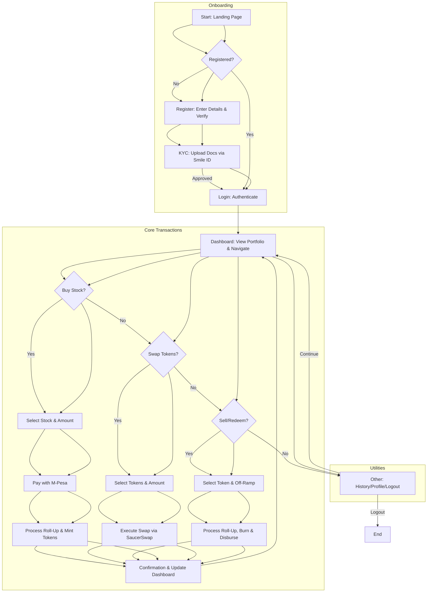
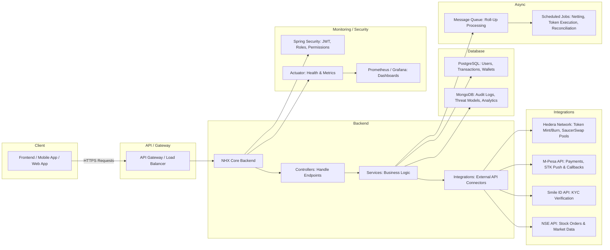
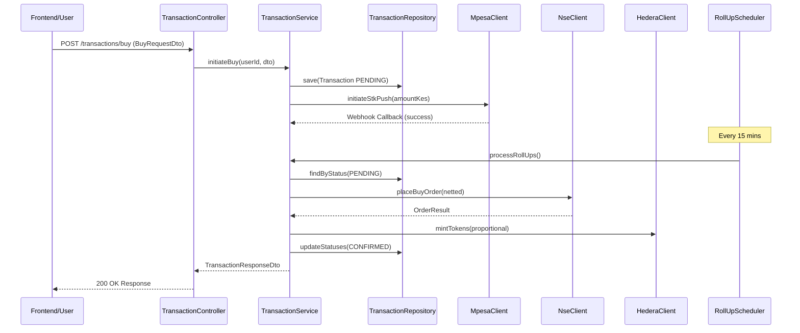
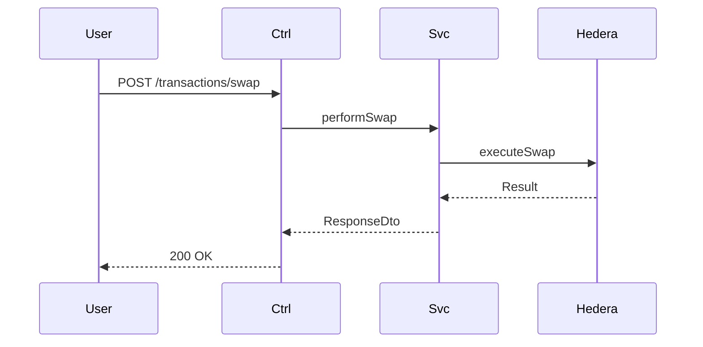
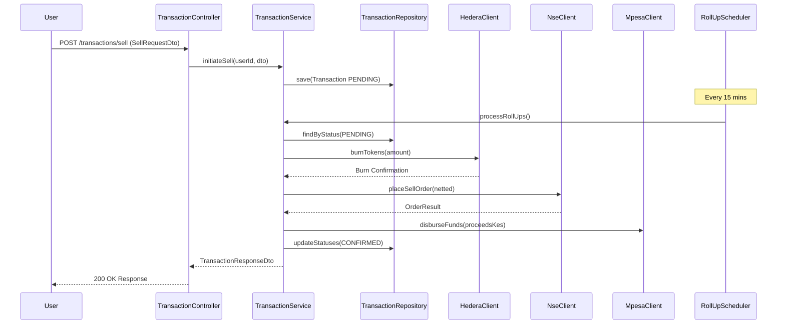
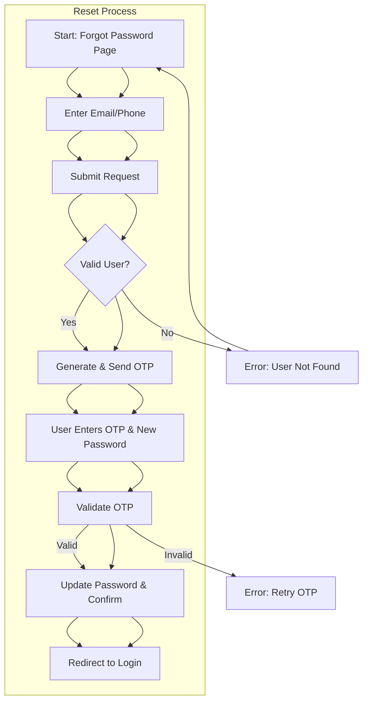
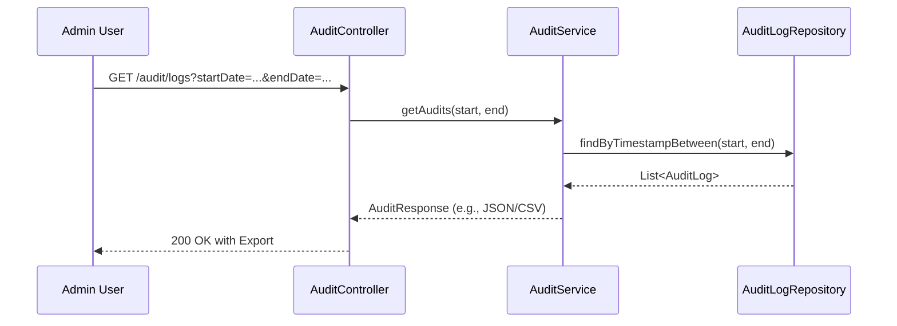

## Flow of Events

```mermaid
flowchart TD
A[Start: Landing Page] --> B{Registered?}
B -->|No| C[Register: Enter Details & Verify]
C --> D[KYC: Upload Docs via Smile ID]
D -->|Approved| E[Login: Authenticate]
B -->|Yes| E
E --> F[Dashboard: View Portfolio & Navigate]
F --> G{Buy Stock?}
G -->|Yes| H[Select Stock & Amount]
H --> I[Pay with M-Pesa]
I --> J[Process Roll-Up & Mint Tokens]
J --> K[Confirmation & Update Dashboard]
K --> F
G -->|No| L{Swap Tokens?}
L -->|Yes| M[Select Tokens & Amount]
M --> N[Execute Swap via SaucerSwap]
N --> K
L -->|No| O{Sell/Redeem?}
O -->|Yes| P[Select Token & Off-Ramp]
P --> Q[Process Roll-Up, Burn & Disburse]
Q --> K
O -->|No| R[Other: History/Profile/Logout]
R -->|Logout| S[End]
R -->|Continue| F
subgraph Onboarding
A --> B --> C --> D --> E
end
subgraph Core Transactions
F --> G --> H --> I --> J --> K
F --> L --> M --> N --> K
F --> O --> P --> Q --> K
end
subgraph Utilities
F --> R
end
```

## Backend Architecture

```mermaid
%% Enterprise Architecture Swimlanes
%% Lanes: Client | API / Gateway | Backend | DB | Integrations | Async | Monitoring/Security

%% Define lanes
flowchart LR
    subgraph Client
        A[Frontend / Mobile App / Web App]
    end

    subgraph "API / Gateway"
        B[API Gateway / Load Balancer]
    end

    subgraph Backend
        C[NHX Core Backend]
        D[Controllers: Handle Endpoints]
        E[Services: Business Logic]
        G[Integrations: External API Connectors]
    end

    subgraph Database
        F1[PostgreSQL: Users, Transactions, Wallets]
        F2[MongoDB: Audit Logs, Threat Models, Analytics]
    end

    subgraph Integrations
        J[Hedera Network: Token Mint/Burn, SaucerSwap Pools]
        K[M-Pesa API: Payments, STK Push & Callbacks]
        L[Smile ID API: KYC Verification]
        M[NSE API: Stock Orders & Market Data]
    end

    subgraph Async
        Q[Message Queue: Roll-Up Processing]
        R[Scheduled Jobs: Netting, Token Execution, Reconciliation]
    end

    subgraph "Monitoring / Security"
        N[Spring Security: JWT, Roles, Permissions]
        O[Actuator: Health & Metrics]
        P[Prometheus / Grafana: Dashboards]
    end

    %% Connections
    A -->|HTTPS Requests| B
    B --> C
    C --> D --> E
    E --> F1
    E --> F2
    E --> G
    G --> J
    G --> K
    G --> L
    G --> M
    E --> Q --> R
    C --> N
    C --> O --> P
```

## Buy Flow

```mermaid
sequenceDiagram
participant User as Frontend/User
participant Ctrl as TransactionController
participant Svc as TransactionService
participant Repo as TransactionRepository
participant Mpesa as MpesaClient
participant Nse as NseClient
participant Hedera as HederaClient
participant Scheduler as RollUpScheduler

    User->>Ctrl: POST /transactions/buy (BuyRequestDto)
    Ctrl->>Svc: initiateBuy(userId, dto)
    Svc->>Repo: save(Transaction PENDING)
    Svc->>Mpesa: initiateStkPush(amountKes)
    Mpesa-->>Svc: Webhook Callback (success)
    Note over Scheduler: Every 15 mins
    Scheduler->>Svc: processRollUps()
    Svc->>Repo: findByStatus(PENDING)
    Svc->>Nse: placeBuyOrder(netted)
    Nse-->>Svc: OrderResult
    Svc->>Hedera: mintTokens(proportional)
    Svc->>Repo: updateStatuses(CONFIRMED)
    Svc-->>Ctrl: TransactionResponseDto
    Ctrl-->>User: 200 OK Response
```

## Swap Flow

```mermaid
sequenceDiagram
    participant User
    participant Ctrl
    participant Svc
    participant Hedera

    User->>Ctrl: POST /transactions/swap
    Ctrl->>Svc: performSwap
    Svc->>Hedera: executeSwap
    Hedera-->>Svc: Result
    Svc-->>Ctrl: ResponseDto
    Ctrl-->>User: 200 OK
```

## Sell Flow

```mermaid
sequenceDiagram
    participant User
    participant Ctrl as TransactionController
    participant Svc as TransactionService
    participant Repo as TransactionRepository
    participant Hedera as HederaClient
    participant Nse as NseClient
    participant Mpesa as MpesaClient
    participant Scheduler as RollUpScheduler

    User->>Ctrl: POST /transactions/sell (SellRequestDto)
    Ctrl->>Svc: initiateSell(userId, dto)
    Svc->>Repo: save(Transaction PENDING)
    Note over Scheduler: Every 15 mins
    Scheduler->>Svc: processRollUps()
    Svc->>Repo: findByStatus(PENDING)
    Svc->>Hedera: burnTokens(amount)
    Hedera-->>Svc: Burn Confirmation
    Svc->>Nse: placeSellOrder(netted)
    Nse-->>Svc: OrderResult
    Svc->>Mpesa: disburseFunds(proceedsKes)  # Or USDC to wallet
    Svc->>Repo: updateStatuses(CONFIRMED)
    Svc-->>Ctrl: TransactionResponseDto
    Ctrl-->>User: 200 OK Response
```

## Password Reset Flow

```mermaid
flowchart TD
    A[Start: Forgot Password Page] --> B[Enter Email/Phone]
    B --> C[Submit Request]
    C --> D{Valid User?}
    D -->|Yes| E[Generate & Send OTP]
    E --> F[User Enters OTP & New Password]
    F --> G[Validate OTP]
    G -->|Valid| H[Update Password & Confirm]
    H --> I[Redirect to Login]
    G -->|Invalid| J[Error: Retry OTP]
    D -->|No| K[Error: User Not Found]
    K --> A
    subgraph Reset Process
    A --> B --> C --> D --> E --> F --> G --> H --> I
    end
```

## Audit Flow

```mermaid
sequenceDiagram
    participant Admin as Admin User
    participant Ctrl as AuditController
    participant Svc as AuditService
    participant Repo as AuditLogRepository

    Admin->>Ctrl: GET /audit/logs?startDate=...&endDate=...
    Ctrl->>Svc: getAudits(start, end)
    Svc->>Repo: findByTimestampBetween(start, end)
    Repo-->>Svc: List<AuditLog>
    Svc-->>Ctrl: AuditResponse (e.g., JSON/CSV)
    Ctrl-->>Admin: 200 OK with Export
```